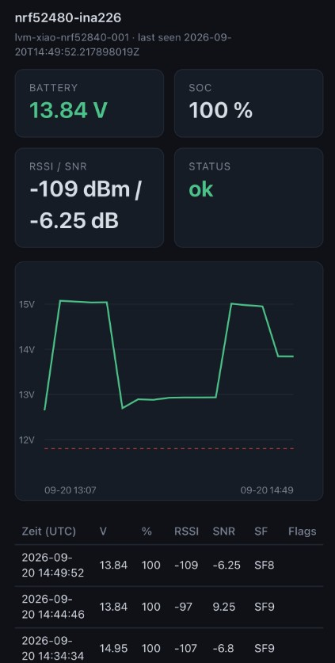
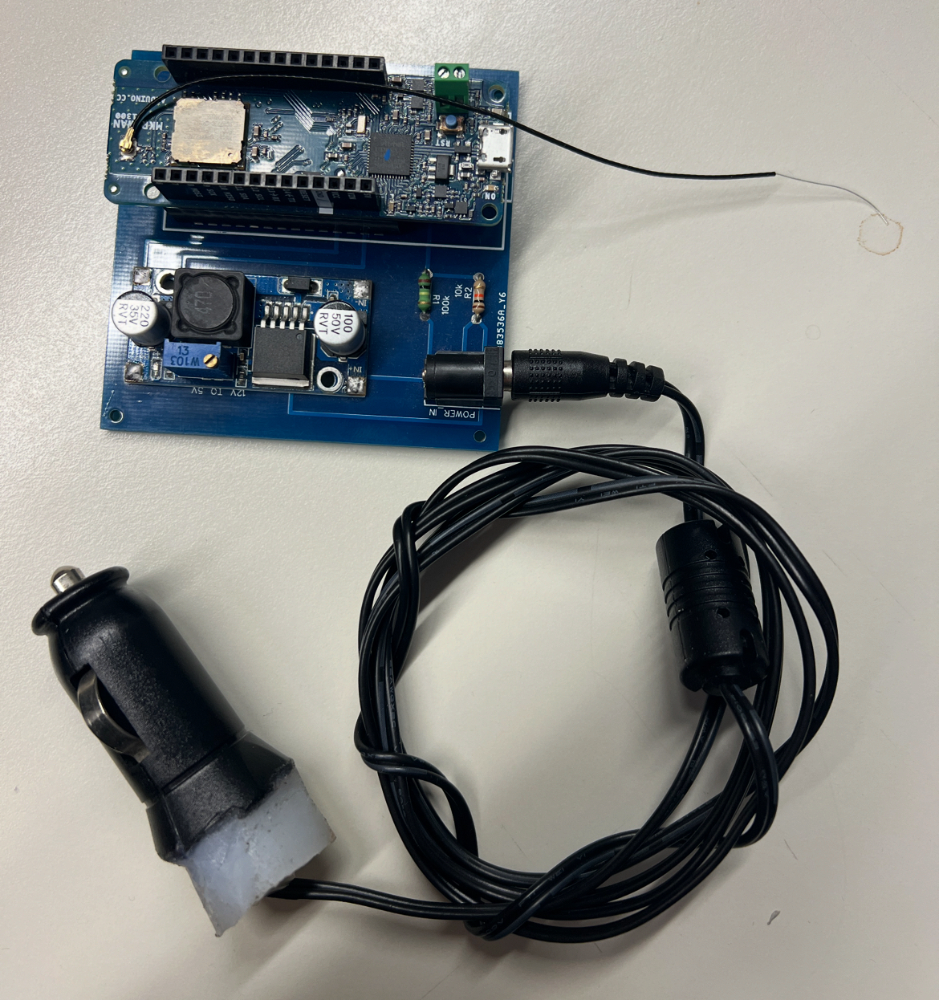
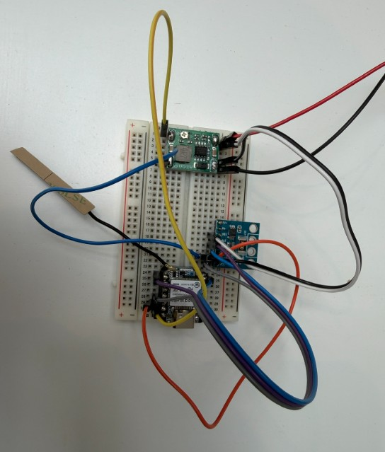
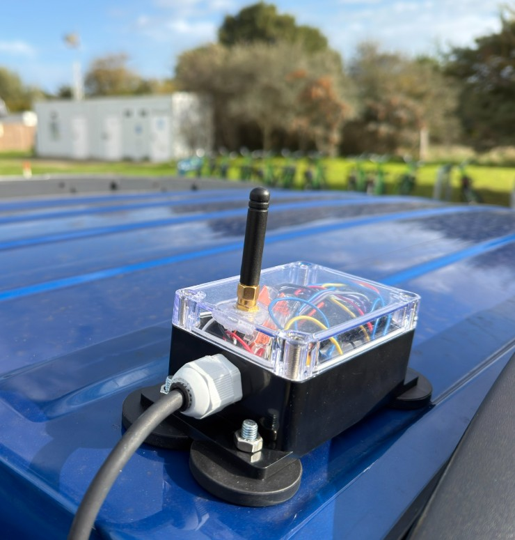
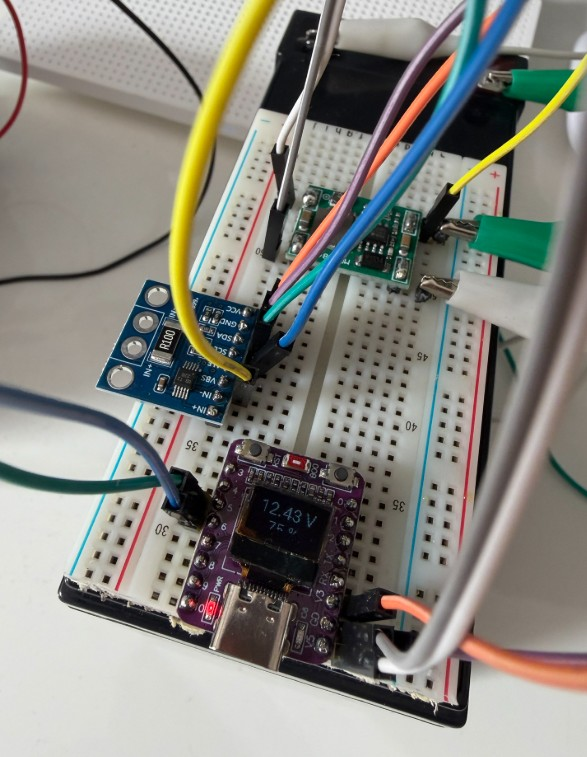

# LoRaWAN or WiFi Voltage Meter for (Car)Batterys or your own usecase!
With a minimal amount of energy and a very long range this project can help you to keep your voltages tracked! Free to use, for a better Planet

## Website Example

## ExampleNode1

[Example Node 1 with Source Code](example-node1)
"Arduino MKR WAN 1300" with LoRaWAN Chip, DC-DC Converter, 2 Resistors, DC-Jack and a DIY 12V Car-Energyplugadapter. It was the first prototype builded a few years ago, the idea was not followed anymore and so we make it now public. The Size of the Device is not so small and its not recommended to rebuild this version anymore!

## LoRaWAN Node (nRF52840 Based)

Based on a Seeed Studio nRF52480 + SX1262 Header as LoRaWAN based Node with a very small energy amount and the INA226 Module

## LoRaWAN Node (Recycled Nucleon Base Node (untested!!!)
no Picture yet

## ESP-C3 WiFi Node
Based on a ESP-C3 with OLED-Display and WiFi Connection its used to work with Home Assistant and not the best effiency in self used energy amount.

## Interesting Links:

[LoRaProMini Node](https://github.com/foorschtbar/LoRaProMini)
